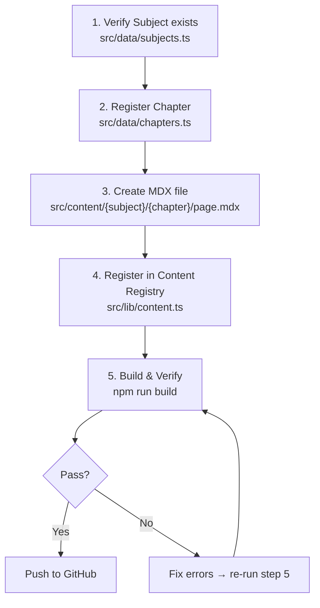

# Chapter Creation Pipeline

> End-to-end guide for adding a chapter to Textbook++.

---

## Pipeline Flow



---

## Quick Reference

| Step | File | Action |
|------|------|--------|
| 1 | `src/data/subjects.ts` | Verify subject exists (add if new) |
| 2 | `src/data/chapters.ts` | Add `Chapter` object to subject array |
| 3 | `src/content/{subject}/{chapter}/page.mdx` | Create MDX file with sections + math + components |
| 4 | `src/lib/content.ts` | Add import + MDX_MAP + SECTIONS_MAP entries |
| 5 | Run `npm run build` | Verify 0 errors, chapter appears in route list |

---

## Step 1: Verify Subject

- Check `src/data/subjects.ts`
- Confirm your subject slug exists (e.g. `"physics"`, `"chemistry"`)
- If new subject:
  - Add to `subjects` array with `id`, `name`, `slug`, `icon`, `color`, `colorLight`, `chapterCount`, `description`
  - Add CSS vars in `globals.css` under both `:root` and `.dark`:
    ```css
    --subject-{name}: #HEXCODE;
    --subject-{name}-light: #HEXCODE;
    ```

---

## Step 2: Register Chapter in Data

- Open `src/data/chapters.ts`
- Add to the correct subject array:

```typescript
{ id: "ph-15", subjectSlug: "physics", number: 15, title: "Communication Systems", slug: "communication-systems", topicCount: 4 }
```

- **Fields:**

| Field | Rule | Example |
|-------|------|---------|
| `id` | `{subject-prefix}-{number}` | `"ph-15"`, `"ch-11"`, `"bi-14"` |
| `subjectSlug` | Must match `subjects.ts` slug | `"physics"` |
| `number` | Chapter number in textbook | `15` |
| `title` | Exact textbook chapter title | `"Communication Systems"` |
| `slug` | Lowercase, hyphens, no special chars | `"communication-systems"` |
| `topicCount` | Number of sub-topics | `4` |

- **ID prefixes:**

| Subject | Prefix |
|---------|--------|
| Physics | `ph` |
| Chemistry | `ch` |
| Mathematics | `ma` |
| Biology | `bi` |
| English | `en` |
| Arabic | `ar` |

---

## Step 3: Create MDX Content File

### File path

```
src/content/{subject-slug}/{chapter-slug}/page.mdx
```

Example:
```
src/content/physics/communication-systems/page.mdx
```

### Required imports

Import only the MDX components you use:

```mdx
import { Callout } from "@/components/mdx/Callout";
import { KeyPoint } from "@/components/mdx/KeyPoint";
import { Formula } from "@/components/mdx/Formula";
import { Example } from "@/components/mdx/Example";
import { Expandable } from "@/components/mdx/Expandable";
import { Diagram } from "@/components/mdx/Diagram";
import { Comparison } from "@/components/mdx/Comparison";
```

### Section headings

- Use `## X.Y Title` format
- These become sidebar links + scroll-spy targets
- The `id` (for scroll-spy) is auto-generated from heading text:
  - Lowercase
  - Spaces → hyphens
  - Special chars removed
  - Example: `## 1.3 Coulomb's Law` → id: `coulombs-law`

```mdx
## 1.1 Electric Charge
Content here...

## 1.2 Conduction and Induction
Content here...
```

### Math syntax

- **Inline:** `$formula$`
- **Display (centered):** `$$formula$$`

```mdx
The charge is $q = 1.6 \times 10^{-19}$ C.

<Formula title="Coulomb's Law">
$$F = k \frac{|q_1 \cdot q_2|}{r^2}$$
</Formula>
```

- KaTeX syntax supported (fractions, integrals, Greek letters, etc.)
- Common commands: `\frac{}{}`, `\times`, `\cdot`, `\sqrt{}`, `\int`, `\sum`, `\alpha`, `\beta`, `\theta`

### Content style

- Use bullet points over long paragraphs
- Break text into short, scannable chunks
- Use MDX components to highlight key info (see components table below)

---

## Step 4: Register in Content Registry

- Open `src/lib/content.ts`
- Add 3 things:

### 4a. Import the MDX file

```typescript
import PhysicsElectricCharges from "@/content/physics/electric-charges-and-fields/page.mdx";
import PhysicsCommunication from "@/content/physics/communication-systems/page.mdx";
```

### 4b. Add to MDX_MAP

```typescript
const MDX_MAP: Record<string, ComponentType> = {
  "electric-charges-and-fields": PhysicsElectricCharges as ComponentType,
  "communication-systems": PhysicsCommunication as ComponentType,
};
```

### 4c. Add to SECTIONS_MAP

```typescript
const SECTIONS_MAP: Record<string, ChapterSection[]> = {
  "electric-charges-and-fields": [
    { id: "electric-charge", title: "1.1 Electric Charge" },
    { id: "conduction-and-induction", title: "1.2 Conduction and Induction" },
  ],
  "communication-systems": [
    { id: "introduction", title: "15.1 Introduction" },
    { id: "elements-of-communication", title: "15.2 Elements of Communication" },
  ],
};
```

- `id` = heading anchor (from `##` heading, lowercased, hyphenated)
- `title` = exact heading text shown in sidebar

---

## Step 5: Build & Verify

```bash
npm run build
```

- Check output for:
  - `✓ Compiled successfully`
  - Your chapter appears under `● /chapter/{slug}`
  - No TypeScript errors

- If errors:
  - `Module not found` → check import path in `content.ts`
  - `TS error` → check type annotations
  - Chapter not in route list → check `chapters.ts` entry

---

## MDX Components Reference

| Component | Props | Use case | Example |
|-----------|-------|----------|---------|
| `Callout` | `type?`: `"note"` \| `"important"` \| `"warning"` \| `"didyouknow"`, `title?`, `children` | Highlight important info | `<Callout type="warning">...</Callout>` |
| `KeyPoint` | `title?` (default: "Key Takeaway"), `children` | Core concept / takeaway | `<KeyPoint>...</KeyPoint>` |
| `Formula` | `title?`, `children` (KaTeX math) | Display equations | `<Formula title="Ohm's Law">$$V=IR$$</Formula>` |
| `Example` | `title?` (default: "Example"), `children` | Worked examples / problems | `<Example title="Example 1">...</Example>` |
| `Expandable` | `title` (required), `children` | Collapsible content / details | `<Expandable title="Derivation">...</Expandable>` |
| `Diagram` | `title?`, `children` | Diagrams / images / figures | `<Diagram title="Figure 1">...</Diagram>` |
| `Comparison` | `leftTitle?`, `rightTitle?`, `left`, `right` | Side-by-side comparison | `<Comparison leftTitle="AC" left={...} rightTitle="DC" right={...} />` |

### Callout types

| Type | Color | Icon | Default label |
|------|-------|------|---------------|
| `note` | Blue | BookOpen | Note |
| `important` | Purple | AlertCircle | Important |
| `warning` | Amber | AlertTriangle | Warning |
| `didyouknow` | Emerald | Lightbulb | Did You Know? |

---

## File Structure

```
src/
├── content/
│   └── {subject-slug}/
│       └── {chapter-slug}/
│           └── page.mdx          ← MDX content file
├── data/
│   ├── subjects.ts               ← Subject definitions
│   └── chapters.ts               ← Chapter definitions (add entry here)
├── lib/
│   └── content.ts                ← MDX_MAP + SECTIONS_MAP (register here)
├── components/
│   └── mdx/
│       ├── Callout.tsx            ← Available MDX components
│       ├── KeyPoint.tsx
│       ├── Formula.tsx
│       ├── Example.tsx
│       ├── Expandable.tsx
│       ├── Diagram.tsx
│       └── Comparison.tsx
└── types/
    └── chapter.ts                ← ChapterSection type
```

---

## Common Mistakes

> **⚠️ Slug mismatch**
> The slug in `chapters.ts` must exactly match the folder name in `src/content/` and the key in `content.ts`.
> Wrong: `"communication_systems"` vs `"communication-systems"`

> **⚠️ Section id not matching heading**
> The `id` in `SECTIONS_MAP` must match the auto-generated anchor from the `##` heading.
> `## 1.3 Coulomb's Law` → id: `coulombs-law` (not `"1.3-coulombs-law"`)

> **⚠️ Missing import in MDX file**
> If you use `<Callout>` in MDX but don't import it, build fails.
> Add: `import { Callout } from "@/components/mdx/Callout";`

> **⚠️ topicCount mismatch**
> `topicCount` in `chapters.ts` should match the number of `##` sections in your MDX file.

> **💡 Tip: Test with dev server**
> Run `npm run dev` and navigate to `/chapter/{slug}` to preview before building.

> **💡 Tip: Use Developer_Deliveries/**
> Drop source content (notes, PDFs, images) in `Developer_Deliveries/` for the AI to integrate into MDX.
