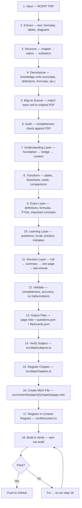

# Chapter Pipeline

> End-to-end: NCERT PDF → Live interactive chapter. One flow. No filler.

---

## Content Rules

- **No long paragraphs.** Default to bullet points. Use paragraphs only when the concept genuinely requires flowing text (e.g., explaining a narrative process, a story-like explanation). Even then, keep under 3 sentences.
- **No filler words.** Cut "simply", "just", "basically", "obviously", "of course", "it is important to note that".
- **No jargon without context.** Every technical term gets a one-line definition on first use.
- **Scannable > readable.** A student should be able to skim and get 80% of the value.
- **Every section answers:** "What does the student need to know?" and nothing else.

---

## Flow



---

## Quick Reference

| Step | Action | Output |
|------|--------|--------|
| 1 | NCERT PDF provided | Source file |
| 2 | Extract all content from PDF | Raw text + data |
| 3 | Reconstruct chapter hierarchy | Topic tree |
| 4 | Break into knowledge units | Unit list |
| 5 | Map each unit to source location | Source traceability |
| 6 | Check completeness vs PDF | Gap report |
| 7 | Build understanding layer by layer | Explanation flow |
| 8 | Convert to interactive formats | Tables, cards, diagrams |
| 9 | Add exam-relevant content | Formulas, PYQs, patterns |
| 10 | Add practice and recall content | Questions, recall prompts |
| 11 | Generate revision views | 5-level summary hierarchy |
| 12 | Final validation | Accuracy + completeness |
| 13 | Output content files | `page.mdx`, `questions.json`, `flashcards.json` |
| 14 | Verify subject exists in code | Subject confirmed |
| 15 | Add chapter to data file | `chapters.ts` entry |
| 16 | Create MDX file with content | `page.mdx` |
| 17 | Register in content registry | `content.ts` entries |
| 18 | Build and verify | 0 errors, chapter live |

---

## Content Creation (Steps 1–13)

### Step 1: Input

- NCERT chapter PDF
- Source must be the actual textbook (not summaries or third-party notes)
- If multiple editions exist, use the rationalised/latest version

### Step 2: Extract

- Text: all paragraphs, headings, subheadings
- Formulas: inline and display math
- Tables: data tables, comparison tables
- Diagrams: labeled figures, circuit diagrams, graphs
- Examples: worked problems, activities, in-text questions
- Exercises: back-of-chapter questions
- Captions: figure/table labels

### Step 3: Structure

- Reconstruct hierarchy:
  - Chapter → Topics → Subtopics → Concepts → Details
- Match NCERT's own section numbering (e.g., 1.1, 1.2, 1.3)
- Preserve section titles exactly as they appear

### Step 4: Decompose

- Break into knowledge units:

| Unit Type | What it captures |
|-----------|-----------------|
| Concepts | Core ideas, principles |
| Definitions | Formal statements |
| Terminology | New terms with meanings |
| Processes | Step-by-step mechanisms |
| Formulas | Equations with variables |
| Derivations | Proof/derivation steps |
| Examples | Worked problems |
| Comparisons | A vs B differences |
| Classifications | Types, categories |
| Causes & effects | Why → what happens |
| Exceptions | Edge cases, special conditions |
| Diagrams | Visual representations |
| Important facts | Must-know data points |

### Step 5: Map to Source

- Every knowledge unit → page/section in original PDF
- Ensures nothing is invented
- Makes verification possible

### Step 6: Audit (Completeness Check)

- Compare generated units against PDF
- Flag:
  - Missing sections
  - Poorly represented concepts
  - Formulas that got lost
  - Examples that were skipped
- Fill gaps before proceeding

### Step 7: Understanding Layer

- Build each concept in layers:

```
Foundation → Bridge → Actual Content
```

- **Foundation**: What the learner needs to know first
- **Bridge**: How the new concept connects to what they know
- **Content**: The actual concept, explained clearly

- Keep it concise. No hand-holding. No filler.
- Goal: shortest path from "I don't know" to "I get it"

### Step 8: Content Transformation

- Convert suitable information into interactive formats:

| Input | Output Format |
|-------|--------------|
| Data with structure | Tables |
| Step-by-step processes | Flowcharts / process maps |
| Two items to compare | Comparison cards |
| Key equations | Formula cards |
| Visual concepts | Diagram descriptions |
| Cause-effect chains | Flow diagrams |
| Classification systems | Concept cards |
| Term definitions | Q&A pairs |

### Step 9: Exam Layer

- Add verified exam-relevant content:

| Content | Why |
|---------|-----|
| Important definitions | Frequently asked verbatim |
| All formulas | Must be memorized |
| Common derivations | Asked in boards regularly |
| Key diagrams | Diagram-based questions |
| PYQs (past year questions) | Pattern recognition |
| Common question patterns | "Most asked" topics |
| High-weightage concepts | Most marks per effort |

### Step 10: Learning Layer

- Generate practice content:

| Type | Purpose |
|------|---------|
| Topic questions | After each section, test understanding |
| Active recall prompts | "What is ___?" style checks |
| Hide/reveal answers | Self-testing mechanism |
| Practice questions | End-of-chapter problems |
| Common mistakes | What students typically get wrong |
| Concept connections | How topics link together |

### Step 11: Revision Layer

- Generate 5 views from the same content:

```
Full Content → Detailed Notes → Revision Notes → One-Page Revision → Last-Minute Recall
```

| View | Level | Use Case |
|------|-------|----------|
| Full Content | 100% detail | First read |
| Detailed Notes | ~60% of full | Week before exam |
| Revision Notes | ~30% of full | Day before exam |
| One-Page Revision | ~10% of full | Quick review |
| Last-Minute Recall | Formulas + key points | Right before exam |

### Step 12: Final Validation

- Check:

| Criteria | Pass/Fail |
|----------|-----------|
| Completeness | All NCERT content covered |
| Accuracy | No factual errors |
| Source alignment | Matches PDF exactly |
| Exam relevance | High-yield content included |
| No hallucinations | Nothing invented |

### Step 13: Output Files

- Content is ready. Output 3 files:

```
src/content/{subject-slug}/{chapter-slug}/
├── page.mdx              ← Learning content (MDX)
├── questions.json        ← Practice questions (MCQ + short answer)
└── flashcards.json       ← Revision flashcards
```

---

## Technical Registration (Steps 14–18)

### Step 14: Verify Subject

- Check `src/data/subjects.ts`
- Confirm subject slug exists (e.g. `"physics"`, `"chemistry"`)
- If new subject:
  - Add to `subjects` array with `id`, `name`, `slug`, `icon`, `color`, `colorLight`, `chapterCount`, `description`
  - Add CSS vars in `globals.css` under both `:root` and `.dark`:
    ```css
    --subject-{name}: #HEXCODE;
    --subject-{name}-light: #HEXCODE;
    ```

### Step 15: Register Chapter in Data

- Open `src/data/chapters.ts`
- Add to the correct subject array:

```typescript
{ id: "ph-15", subjectSlug: "physics", number: 15, title: "Communication Systems", slug: "communication-systems", topicCount: 4 }
```

- **Fields:**

| Field | Rule | Example |
|-------|------|---------|
| `id` | `{subject-prefix}-{number}` | `"ph-15"`, `"ch-11"`, `"bi-14"` |
| `subjectSlug` | Must match `subjects.ts` slug | `"physics"` |
| `number` | Chapter number in textbook | `15` |
| `title` | Exact textbook chapter title | `"Communication Systems"` |
| `slug` | Lowercase, hyphens, no special chars | `"communication-systems"` |
| `topicCount` | Number of sub-topics | `4` |

- **ID prefixes:**

| Subject | Prefix |
|---------|--------|
| Physics | `ph` |
| Chemistry | `ch` |
| Mathematics | `ma` |
| Biology | `bi` |
| English | `en` |
| Arabic | `ar` |

### Step 16: Create MDX File

- Path: `src/content/{subject-slug}/{chapter-slug}/page.mdx`
- Import only the MDX components you use:

```mdx
import { Callout } from "@/components/mdx/Callout";
import { KeyPoint } from "@/components/mdx/KeyPoint";
import { Formula } from "@/components/mdx/Formula";
import { Example } from "@/components/mdx/Example";
import { Expandable } from "@/components/mdx/Expandable";
import { Diagram } from "@/components/mdx/Diagram";
import { Comparison } from "@/components/mdx/Comparison";
```

- Use `## X.Y Title` format for sections (becomes sidebar + scroll-spy)
- Math: `$inline$` or `$$display$$` (KaTeX syntax)
- Style: bullet points > paragraphs, short chunks, MDX components for key info

### Step 17: Register in Content Registry

- Open `src/lib/content.ts`
- Add 3 things:

**17a. Import the MDX file:**
```typescript
import PhysicsCommunication from "@/content/physics/communication-systems/page.mdx";
```

**17b. Add to MDX_MAP:**
```typescript
const MDX_MAP: Record<string, ComponentType> = {
  "communication-systems": PhysicsCommunication as ComponentType,
};
```

**17c. Add to SECTIONS_MAP:**
```typescript
const SECTIONS_MAP: Record<string, ChapterSection[]> = {
  "communication-systems": [
    { id: "introduction", title: "15.1 Introduction" },
    { id: "elements-of-communication", title: "15.2 Elements of Communication" },
  ],
};
```

**17d. Add to QUESTIONS_MAP (if questions.json exists):**
```typescript
import PhysicsCommunicationQuestions from "@/content/physics/communication-systems/questions.json";

const QUESTIONS_MAP: Record<string, Question[]> = {
  "communication-systems": PhysicsCommunicationQuestions as Question[],
};
```

**17e. Add to FLASHCARDS_MAP (if flashcards.json exists):**
```typescript
import PhysicsCommunicationFlashcards from "@/content/physics/communication-systems/flashcards.json";

const FLASHCARDS_MAP: Record<string, Flashcard[]> = {
  "communication-systems": PhysicsCommunicationFlashcards as Flashcard[],
};
```

- `SECTIONS_MAP` id = heading anchor (lowercased, hyphenated from `##` heading)

### Step 18: Build & Verify

```bash
npm run build
```

- Check output for:
  - `✓ Compiled successfully`
  - Your chapter appears under `● /chapter/{slug}`
  - No TypeScript errors

- If errors:
  - `Module not found` → check import path in `content.ts`
  - `TS error` → check type annotations
  - Chapter not in route list → check `chapters.ts` entry

---

## MDX Components Reference

| Component | Props | Use case |
|-----------|-------|----------|
| `Callout` | `type?`: `"note"` \| `"important"` \| `"warning"` \| `"didyouknow"`, `title?`, `children` | Highlight important info |
| `KeyPoint` | `title?` (default: "Key Takeaway"), `children` | Core concept / takeaway |
| `Formula` | `title?`, `children` (KaTeX math) | Display equations |
| `Example` | `title?` (default: "Example"), `children` | Worked examples / problems |
| `Expandable` | `title` (required), `children` | Collapsible content |
| `Diagram` | `title?`, `children` | Diagrams / images / figures |
| `Comparison` | `leftTitle?`, `rightTitle?`, `left`, `right` | Side-by-side comparison |

### Callout types

| Type | Color | Icon | Default label |
|------|-------|------|---------------|
| `note` | Blue | BookOpen | Note |
| `important` | Purple | AlertCircle | Important |
| `warning` | Amber | AlertTriangle | Warning |
| `didyouknow` | Emerald | Lightbulb | Did You Know? |

---

## Question & Flashcard Format

### questions.json

```json
[
  {
    "id": "q1",
    "type": "mcq",
    "difficulty": "easy",
    "question": "What is the charge of an electron?",
    "options": ["+1.6 × 10⁻¹⁹ C", "-1.6 × 10⁻¹⁹ C", "0 C", "3.2 × 10⁻¹⁹ C"],
    "answer": 1,
    "explanation": "The electron carries the elementary negative charge."
  },
  {
    "id": "q12",
    "type": "short",
    "difficulty": "medium",
    "question": "State Coulomb's Law.",
    "answer": "The force between two charges is...",
    "explanation": "This is the fundamental law of electrostatics."
  }
]
```

### flashcards.json

```json
[
  {
    "id": "fc1",
    "front": "What is electric charge?",
    "back": "A fundamental property of matter that determines electromagnetic force."
  }
]
```

---

## File Structure

```
src/
├── content/{subject-slug}/{chapter-slug}/
│   ├── page.mdx              ← Learning content
│   ├── questions.json        ← Practice questions
│   └── flashcards.json       ← Revision flashcards
├── data/
│   ├── subjects.ts           ← Subject definitions
│   └── chapters.ts           ← Chapter definitions
├── lib/
│   └── content.ts            ← MDX_MAP + SECTIONS_MAP + QUESTIONS_MAP + FLASHCARDS_MAP
├── components/mdx/           ← MDX components (Callout, KeyPoint, Formula, etc.)
├── components/practice/      ← QuestionCard, PracticeSession, DifficultyFilter
├── components/flashcard/     ← FlashcardCard, FlashcardDeck, FlashcardProgress
└── types/chapter.ts          ← ChapterSection, Question, Flashcard types
```

---

## Common Mistakes

> **⚠️ Slug mismatch**
> Slug in `chapters.ts` must match folder name in `src/content/` and key in `content.ts`.
> Wrong: `"communication_systems"` vs `"communication-systems"`

> **⚠️ Section id not matching heading**
> `id` in `SECTIONS_MAP` must match auto-generated anchor from `##` heading.
> `## 1.3 Coulomb's Law` → id: `coulombs-law` (not `"1.3-coulombs-law"`)

> **⚠️ Missing import in MDX file**
> If you use `<Callout>` in MDX but don't import it, build fails.
> Add: `import { Callout } from "@/components/mdx/Callout";`

> **⚠️ topicCount mismatch**
> `topicCount` in `chapters.ts` should match the number of `##` sections in your MDX file.

> **⚠️ Hallucinated content**
> Every formula, definition, and example must come from the NCERT PDF. Never invent.

> **⚠️ Skipping the audit step**
> Always compare generated content against the source PDF before registering.

> **💡 Test with dev server**
> Run `npm run dev` and navigate to `/chapter/{slug}` to preview before building.

> **💡 Use Developer_Deliveries/**
> Drop source content (PDFs, notes, images) in `Developer_Deliveries/` for the AI to process through this pipeline.
