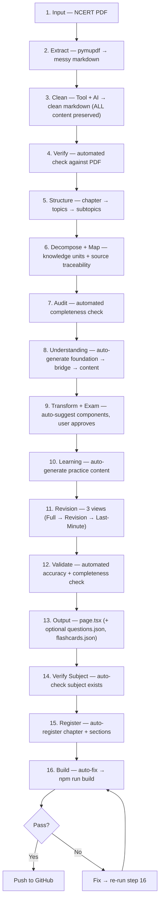

# Chapter Pipeline

> End-to-end: NCERT PDF → Live interactive chapter. One flow. No filler.

---

## Execution Approach

Each chapter follows a **step-by-step, brick-by-brick** workflow with user approval at every decision point.

### Workflow

1. **Show output of each step** before moving to the next
2. **User approves** via question tool (clickable MCQ modal) before proceeding
3. **No step is skipped** — every step must complete and be approved
4. **Content quality is the priority** — completeness and accuracy to NCERT source over speed
5. **Perfection standard** — severity-based. Small errors fix forward, major errors redo from Step 1.

### Decision Points (MCQ Modals)

At each step, the AI presents the output and asks the user to choose:

| Step | Decision |
|------|----------|
| Step 2 | Extraction complete — proceed to cleaning? |
| Step 3 | Clean markdown ready — proceed to verification? |
| Step 4 | Verification passed — proceed to structure? |
| Steps 5-7 | Analysis complete — proceed to content creation? |
| Steps 8-10 | Content layers done — proceed to revision? |
| Step 11 | Revision ready — proceed to validation? |
| Step 16 | Build passes — commit + push? |

### Content Rules (Non-Negotiable)

- **NCERT source is truth** — every formula, definition, example must come from the extraction file. Never invent.
- **Examples included** — all NCERT worked examples with complete solutions
- **Supplementary content** — non-NCERT examples kept as "Supplementary Example" (user decides per chapter)
- **Verify against PDF** — Step 4 is automated but mandatory. Compare extraction line-by-line.

---

## Source of Truth

Every chapter starts with a **complete extraction** (Step 2). The cleaned markdown file becomes the single source of truth for all subsequent steps. Never go back to the PDF — everything you need is in the extraction.

```
Developer_Deliveries/Chapters/{Subject}/{chapter-slug}-extracted.md
```

This file is **permanent** — it stays in the repo as the reference. Content transformations (Steps 8–10) read from this file, not the PDF.

---

## Per-Subject Pipelines

Each subject has its own pipeline file with **dynamic steps** tailored to its content type. The master pipeline above defines shared steps; subject files add subject-specific rules, component suggestions, and validation criteria.

| Subject | Chapters | Pipeline File | Key Components |
|---------|----------|---------------|----------------|
| Physics | 14 | `PIPELINE_PHYSICS.md` | FormulaCard, ProcessCard, FlowDiagram, MetricCard |
| Chemistry | 10 | `PIPELINE_CHEMISTRY.md` | FlowDiagram, CycleDiagram, TableCard, ConceptCard |
| Mathematics | 13 | `PIPELINE_MATHEMATICS.md` | FormulaCard, Stepper, GuidedStepper, ProblemSolution |
| Biology | 13 | `PIPELINE_BIOLOGY.md` | TreeDiagram, CycleDiagram, Timeline, ConceptCard |
| English | 14 | `PIPELINE_ENGLISH.md` | Comparison, Checklist, PerspectiveCard, MistakeCard |
| Arabic | 12 | `PIPELINE_ARABIC.md` | Same as English + RTL layout support |

**Rule:** Each subject pipeline is self-contained. Follow the subject-specific file when working on chapters in that subject.

---

## Content Rules

### NCERT Fidelity

- **Definitions + laws = verbatim.** Copy NCERT's exact phrasing. Add bold/Markdown formatting for readability, but do not change words.
- **Everything else = faithful rewrite.** Explanations, examples context, notes can be reworded for clarity — but no information lost.
- **Formulas = exact.** Every variable, subscript, superscript, vector notation must match NCERT precisely.

### Paragraph Rules

- **Default: asterisk bullet points (`*`).** One fact per bullet.
- **Short paragraphs allowed** (2-3 sentences max) — use sparingly, only when bullets would break flow.
- **Filler removal is subject-dependent.** Science subjects: strict removal. Literature subjects: allow some for readability.

### Scannability

- **Balance scannable AND readable.** Subject-dependent:
  - **Science (Physics, Chemistry, Maths, Biology):** Scannable > readable. Student skims and gets 80% value.
  - **Literature (English, Arabic):** Readable > scannable. Text needs flow and context.
- **Every section answers:** "What does the student need to know?" and nothing else.
- **No jargon without context.** Every technical term gets a one-line definition on first use.

### Component Rules

| Content Type | JSX Component | Format |
|-------------|---------------|--------|
| **Definitions** | `Callout` (important) + bullet breakdown | Verbatim NCERT in callout, then `*` bullets below |
| **Laws/Statements** | `Callout` (important) | Verbatim NCERT law statement |
| **Derivations** | `Expandable` (collapsed) | Full step-by-step, formulas in KaTeX |
| **Examples** | `Example` | Full NCERT solution, unmodified |
| **Try These** | `Expandable` (collapsed) | Question text, click to reveal |
| **NCERT Notes/Remarks** | `Callout` (note) | Blue callout, labeled 'Note' |
| **Key Insights** | `KeyPoint` | Added after bullet breakdown if insight exists |
| **Comparisons** | `Comparison` | Side-by-side, two items |
| **Formulas** | `FormulaBlock` / `FormulaCard` | KaTeX rendering, grouped formulas |
| **Processes** | `ProcessCard` / `FlowDiagram` | Sequential steps, cause-effect chains |
| **Classifications** | `ConceptCard` / `TreeDiagram` | 3+ categories, hierarchies |
| **Problems** | `ProblemSolution` | Given → Formula → Solution → Answer |
| **Supplementary Examples** | `Example` with "Supplementary" label | Non-NCERT extras, user decides per chapter |

---

## Flow



---

## Quick Reference

| Step | Action | Output | Automation |
|------|--------|--------|------------|
| 1 | NCERT PDF provided | Source file | Manual |
| **2** | **Extract with pymupdf** | **Messy markdown** | Tool |
| **3** | **Clean/reformat** | **Clean markdown (all content preserved)** | Tool + AI |
| **4** | **Verify against PDF** | **Gap-filled extraction** | Automated |
| 5 | Reconstruct chapter hierarchy | Topic tree | Manual |
| **6** | **Decompose + map knowledge units** | **Units + source traceability** | Auto-map |
| **7** | **Audit completeness** | **Gap report** | Automated |
| 8 | Understanding layer | Foundation → bridge → content | Auto-generate |
| **9** | **Transform + exam content** | **Interactive formats + exam material** | Auto-suggest + approve |
| 10 | Learning layer | Practice content | Auto-generate |
| 11 | Revision layer | 3 summary views | Manual |
| **12** | **Final validation** | **Accuracy + completeness** | Automated |
| 13 | Output content files | `page.tsx` (+ optional `questions.json`, `flashcards.json`) | Auto-generate |
| **14** | **Verify subject exists** | **Subject confirmed** | Automated |
| **15** | **Register chapter + sections** | **chapters.ts + SECTIONS_MAP entries** | Auto-register |
| **16** | **Build & verify** | **0 errors, chapter live** | Auto-fix → build |

---

## Content Creation (Steps 1–12)

### Step 1: Input

- NCERT chapter PDF
- Source must be the actual textbook (not summaries or third-party notes)
- If multiple editions exist, use the rationalised/latest version

### Step 2: Complete Exhaustive Extraction

> This is the most critical step. Everything downstream depends on it.

Use **pymupdf** (or similar tool) to extract everything from the NCERT PDF into a single markdown file:

```
Developer_Deliveries/Chapters/{Subject}/{chapter-slug}-extracted.md
```

**What to extract (leave nothing out):**

| Category | What to capture | Format in extraction |
|----------|----------------|---------------------|
| **Headings** | All section/subsection headings with NCERT numbering | `## X.Y Title` |
| **Body text** | Every paragraph, word-for-word where possible | Plain text under headings |
| **Formulas** | All inline and display math | `$...$` and `$$...$$` (KaTeX) |
| **Derivations** | Complete step-by-step derivation text | Numbered steps with formulas |
| **Examples** | All worked examples (Example X.X) with full solutions | `### Example X.X — Title` + full solution |
| **Tables** | All data/comparison tables | Markdown tables |
| **Figures** | Describe every figure (what it shows, labels, axes) | `**Figure X.X:** Description` |
| **In-text questions** | "Try These", "Think and Discuss", margin activities | `> **Try These:** Question text` |
| **Back-of-chapter exercises** | ALL exercise questions, verbatim | `### Exercises` + numbered list |
| **Points to Ponder** | Complete text | `## Points to Ponder` |
| **Summary** | Chapter summary section | `## Summary` |
| **Key terms** | Bold/defined terms in the text | `**term**: definition` |
| **Activities** | Any hands-on activities described | `### Activity` blocks |
| **Notes/Remarks** | NCERT sidebar notes, warnings | `> **Note:** text` |

**Rules:**
- Preserve NCERT's exact wording for definitions, formulas, and examples
- Preserve section numbering (1.1, 1.2, etc.)
- For figures: describe in detail (labels, arrows, axes, what's shown) — we can't embed images, but the description must be complete enough to recreate them
- For formulas: use KaTeX syntax, preserve all subscripts/superscripts/vectors
- Include page numbers from the PDF as comments: `<!-- p.17 -->`
- **This is the raw extraction — it will be messy. That's expected. Cleaning happens in Step 3.**

### Step 3: Clean/Reformat

> Make the messy extraction readable while keeping ALL content.

**Tool + AI approach:**
1. **Tool first**: Use pandoc or similar to auto-format markdown structure
2. **AI polish**: Clean up formatting, fix broken tables, normalize headings, ensure consistent structure

**What to do:**
- Fix broken markdown (unclosed tags, malformed tables, misaligned lists)
- Normalize heading levels (## for sections, ### for subsections)
- Ensure KaTeX formulas render correctly
- Fix encoding issues (special characters, unicode)
- Add proper spacing between sections
- **DO NOT remove any content** — this is reformatting, not editing

**What NOT to do:**
- Do not cut any paragraphs, formulas, examples, or sections
- Do not reword NCERT text
- Do not change section numbering
- Do not add new content

**Output:** Clean, readable markdown file ready for verification.

### Step 4: Verify Extraction

> Automated comparison against PDF.

- Automated tool compares extracted file against PDF, section by section
- Check: any skipped paragraphs? Missing formulas? Incomplete examples?
- Check: exercise questions — are all present, verbatim?
- Check: figures — are all described?
- Fill any gaps before proceeding
- **This step is mandatory.** Do not skip.

### Step 5: Structure

- Reconstruct hierarchy **from the extraction file** (not the PDF):
  - Chapter → Topics → Subtopics → Concepts → Details
- Match NCERT's own section numbering (e.g., 1.1, 1.2, 1.3)
- Preserve section titles exactly as they appear in extraction

### Step 6: Decompose + Map to Source

- Break into knowledge units AND map each to extraction file + line references
- Knowledge unit types:

| Unit Type | What it captures |
|-----------|-----------------|
| Concepts | Core ideas, principles |
| Definitions | Formal statements |
| Terminology | New terms with meanings |
| Processes | Step-by-step mechanisms |
| Formulas | Equations with variables |
| Derivations | Proof/derivation steps |
| Examples | Worked problems |
| Comparisons | A vs B differences |
| Classifications | Types, categories |
| Causes & effects | Why → what happens |
| Exceptions | Edge cases, special conditions |
| Diagrams | Visual representations |
| Important facts | Must-know data points |

- Every knowledge unit → section + line reference **in the extraction file**
- Format: `(see extraction file, Section X.Y, ~line N)`
- Ensures nothing is invented
- Makes verification possible

### Step 7: Audit

> Automated completeness check.

- Automated tool compares generated units against **extraction file**
- Flag:
  - Missing sections
  - Poorly represented concepts
  - Formulas that got lost
  - Examples that were skipped
- Fill gaps before proceeding

### Step 8: Understanding Layer

> Auto-generate foundation → bridge → content.

- Build each concept in layers:

```
Foundation → Bridge → Actual Content
```

- **Foundation**: What the learner needs to know first
- **Bridge**: How the new concept connects to what they know
- **Content**: The actual concept, explained clearly

- **Definitions + laws**: Verbatim NCERT in `Callout` (important), then bullet breakdown below
- **Body text**: Asterisk bullet points (`*`), one fact per bullet. Short paragraphs (2-3 sentences) allowed sparingly.
- **Fillers removed** (subject-dependent): "simply", "just", "basically", "obviously" — strict for science, flexible for literature
- **After bullets**: Add `KeyPoint` only if the section has a core insight
- **Derivations**: Full step-by-step in `Expandable` (collapsed) — KaTeX formulas
- Goal: shortest path from "I don't know" to "I get it"

### Step 9: Transform + Exam Content

> Auto-suggest components, user approves via MCQ.

Convert suitable information into interactive formats AND add exam-relevant content.

#### Top 15 Transformations (Most Used)

| Input | Output Format | When to Use |
|-------|--------------|-------------|
| Data with structure | `TableCard` | Multi-column data, numerical relationships |
| Step-by-step processes | `Stepper` | Numbered sequential processes |
| Two items to compare | `Comparison` | Exactly 2 items, side-by-side |
| Key equations | `FormulaCard` | Prominent constant display, memorisation |
| Cause-effect chains | `FlowDiagram` | Reaction mechanisms, multi-stage processes |
| Classification systems | `ConceptCard` | 3+ categories, hierarchical grouping |
| Term definitions | `FactCard` | Single-sentence takeaways, quick recall |
| Hierarchies / levels | `TreeDiagram` | Multi-level classifications, dependency graphs |
| Cycles / recurring processes | `CycleDiagram` | Repetitive cycles, seasonal patterns |
| Problems and solutions | `ProblemSolution` | Worked examples, problem-solving practice |
| Important facts | `MetricCard` | Single value emphasis, progress tracking |
| Common mistakes | `MistakeCard` | Error prevention, learning from errors |
| Multiple perspectives | `PerspectiveCard` | Side-by-side viewpoints |
| Instructions with checkpoints | `GuidedStepper` | Numbered checkpoints, progress tracking |
| Relationships between entities | `NetworkDiagram` | Connection maps, hub-and-spoke |

> **Note:** Be willing to create new component types without a second thought if a better representation is found. The above are guidelines, not constraints.

#### Decision Framework

For any content unit, apply this priority:

```
1. Has 2 items to compare?        → Comparison Card (highest priority)
2. Has key equation + constants?  → Formula Card
3. Is a sequential process?       → Stepper
4. Is a definition to memorise?   → Fact Card
5. Is a classification of 3+?     → Concept Card / Tree
6. Is a problem with solution?    → Problem–Solution Card
7. Is a timeline/sequence?        → Stepper or Timeline
8. Is a risk/decision analysis?   → Decision Matrix / Risk Matrix
9. Is a cycle/process loop?       → Cycle Diagram
10. Is a system/component map?    → Architecture Diagram
```

#### Exam Content to Add

| Content | Why |
|---------|-----|
| Important definitions | Frequently asked verbatim |
| All formulas | Must be memorized |
| Common derivations | Asked in boards regularly |
| Key diagrams | Diagram-based questions |
| PYQs (past year questions) | Pattern recognition |
| Common question patterns | "Most asked" topics |
| High-weightage concepts | Most marks per effort |

#### Efficiency Principles

- **Content-first:** Transformation only if it adds interpretive value
- **Density with depth:** Compress information without losing semantic content
- **Context-preserving:** Every transformation retains the original meaning
- **Progressive disclosure:** Start simple, reveal detail on interaction
- **No orphan content:** Every transformed piece connects back to learning objectives

### Step 10: Learning Layer

> Auto-generate practice content.

| Type | Purpose |
|------|---------|
| Topic questions | After each section, test understanding |
| Active recall prompts | "What is ___?" style checks |
| Hide/reveal answers | Self-testing mechanism |
| Practice questions | End-of-chapter problems |
| Common mistakes | What students typically get wrong |
| Concept connections | How topics link together |

### Step 11: Revision Layer

> Generate 3 views from the same content:

```
Full Content → Revision Notes → Last-Minute Recall
```

| View | Level | Use Case |
|------|-------|----------|
| Full Content | 100% detail | First read |
| Revision Notes | ~30% of full | Day before exam |
| Last-Minute Recall | Formulas + key points | Right before exam |

### Step 12: Final Validation

> Automated accuracy + completeness check.

- Automated tool checks:

| Criteria | Pass/Fail |
|----------|-----------|
| Completeness | All NCERT content covered |
| Accuracy | No factual errors |
| Source alignment | Matches extraction file exactly |
| Exam relevance | High-yield content included |
| No hallucinations | Nothing invented |

---

## Output & Registration (Steps 13–16)

### Step 13: Output Files

Content is ready. Output files:

```
src/content/{subject-slug}/{chapter-slug}/
├── page.tsx           ← React component (learning content)
├── questions.json     ← Practice questions (optional — add when they add value)
└── flashcards.json    ← Revision flashcards (optional — add when they add value)
```

- **page.tsx** contains JSX with custom React components (Callout, Expandable, KeyPoint, etc.)
- **Math formulas**: KaTeX via `Formula`/`FormulaBlock` components
- **Questions/flashcards are optional** — only add when they genuinely add value for that chapter

### Step 14: Verify Subject

- Automated check: `src/data/subjects.ts`
- Confirm subject slug exists (e.g. `"physics"`, `"chemistry"`)
- Edge case: if new subject, auto-add with required fields

### Step 15: Register Chapter + Sections

> Auto-register chapter and sections together.

- **Chapter registration**: Auto-add entry to `src/data/chapters.ts`
- **Section registration**: Auto-generate section IDs from `page.tsx` headings → add to `SECTIONS_MAP` in `src/lib/content.ts`
- **One step, two outputs**

### Step 16: Build & Verify

```bash
npm run build
```

- Auto-fix common errors before build
- Check output for:
  - `✓ Compiled successfully`
  - Your chapter appears under `● /chapter/{slug}`
  - No TypeScript errors

- If errors:
  - `Module not found` → check `page.tsx` path matches folder structure
  - `TS error` → check type annotations
  - Chapter not in route list → check `chapters.ts` entry
  - Chapter not rendering → check `SECTIONS_MAP` entry in `content.ts`

---

## Component Architecture

All transformation types have corresponding React components in `src/components/content/`. Components are organised by category:

```
src/components/content/
├ (core)       Callout, Example, KeyPoint, Comparison, Expandable,
│              Formula, FormulaBlock, FormulaCard, ProblemSolution, Stepper
├ data/        TableCard, Checklist, SortableTable, Kanban
├ process/     ProcessCard, FlowDiagram, CycleDiagram, Timeline
├ concept/     ConceptCard, FactCard, TreeDiagram, NetworkDiagram
├ decision/    DecisionTree, RiskMatrix, ScenarioCard, PerspectiveCard
├ study/       MetricCard, MistakeCard, GuidedStepper
└ system/      ArchitectureCard, IODiagram, EventFlow, RoadmapCard
```

Subject-specific components (not in barrel export): AuthorCard, CharacterSketch, CharacterComparison, ContentTabs, SummaryLevels, ReadRespond, Highlight.

**Barrel export:** `src/components/content/index.ts` exports all 30 transformation components.

---

## File Structure

```
src/
├ content/{subject-slug}/{chapter-slug}/
│   ├── page.tsx           ← React component (learning content)
│   ├── questions.json     ← Practice questions (optional)
│   └── flashcards.json    ← Revision flashcards (optional)
├ data/
│   ├── subjects.ts        ← Subject definitions
│   └── chapters.ts        ← Chapter definitions
├ lib/
│   ├── content.ts         ← SECTIONS_MAP + QUESTIONS_MAP + FLASHCARDS_MAP
│   ├── transformations.ts ← Transformation registry (maps content types → components)
│   └── utils.ts           ← cn() utility (clsx + tailwind-merge)
├ components/
│   ├── content/           ← Content components (30+ transformation components)
│   ├── practice/          ← QuestionCard, PracticeSession, DifficultyFilter
│   └── flashcard/         ← FlashcardCard, FlashcardDeck, FlashcardProgress
└ types/chapter.ts         ← ChapterSection, Question, Flashcard types
```

---

## Common Mistakes

> **Slug mismatch**
> Slug in `chapters.ts` must match folder name in `src/content/` and key in `SECTIONS_MAP`.
> Wrong: `"communication_systems"` vs `"communication-systems"`

> **Section id not matching heading**
> `id` in `SECTIONS_MAP` must match auto-generated anchor from `##` heading.
> `## 1.3 Coulomb's Law` → id: `coulombs-law` (not `"1.3-coulombs-law"`)

> **page.tsx not in correct path**
> Must be at `src/content/{subject-slug}/{chapter-slug}/page.tsx`.
> The dynamic import in `chapter-content.tsx` only finds files at this exact path.

> **topicCount mismatch**
> `topicCount` in `chapters.ts` should match the number of `##` sections in your chapter content.

> **Hallucinated content**
> Every formula, definition, and example must come from the extraction file. Never invent.

> **NCERT definitions rewritten**
> Definitions and laws must be verbatim from NCERT (with bold formatting). Only explanations can be reworded.

> **Fillers left in content**
> Cut filler words from science sections: "simply", "just", "basically", "obviously", "of course". Preserve the fact, remove the fluff.

> **Skipping the audit step**
> Always compare generated content against the extraction file before registering.

> **Missing SECTIONS_MAP entry**
> `page.tsx` headings must map to `SECTIONS_MAP` entries in `content.ts`. Without it, the sidebar/scroll-spy won't work.

> **Questions/flashcards added without value**
> Don't force practice content into every chapter. Only add when it genuinely helps learning.

> **Revision views skipped**
> Every chapter MUST have all 3 revision views (Full → Revision → Last-Minute). This is non-negotiable.

> **Component chosen without thinking**
> Don't default to the same component for every section. Match the component to the content type.

> **Test with dev server**
> Run `npm run dev` and navigate to `/chapter/{slug}` to preview before building.

> **Use Developer_Deliveries/**
> Drop source content (PDFs, notes, images) in `Developer_Deliveries/` for the AI to process through this pipeline.
