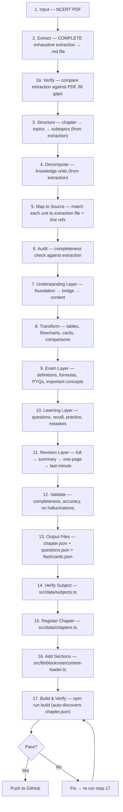

# Chapter Pipeline

> End-to-end: NCERT PDF → Live interactive chapter. One flow. No filler.

---

## Execution Approach

Each chapter follows a **step-by-step, brick-by-brick** workflow with user approval at every decision point.

### Workflow

1. **Show output of each step** before moving to the next
2. **User approves** via MCQ modal (clickable options) before proceeding
3. **No step is skipped** — every step must complete and be approved
4. **Content quality is the priority** — completeness and accuracy to NCERT source over speed
5. **Perfection standard** — no mistakes, no matter how long it takes. Full pipeline redo from Step 1 if needed.

### Decision Points (MCQ Modals)

At each step, the AI presents the output and asks the user to choose:

| Step | Decision |
|------|----------|
| Step 2 | Extraction complete — proceed to verification? |
| Step 2a | Verification done — gaps filled? proceed? |
| Steps 3-6 | Analysis complete — proceed to content creation? |
| Step 7-12 | Content layers done — proceed to output? |
| Step 13 | Output files ready — proceed to registration? |
| Step 17 | Build passes — commit + push? |

### Content Rules (Non-Negotiable)

- **NCERT source is truth** — every formula, definition, example must come from the extraction file. Never invent.
- **Body text in chapter.json** — expand all sections with full explanations, not just component placeholders
- **Examples included** — all NCERT worked examples with complete solutions
- **Supplementary content** — non-NCERT examples kept as "Supplementary Example" (user decides per chapter)
- **Verify against PDF** — Step 2a is mandatory. Compare extraction line-by-line against pymupdf output.

---

## Source of Truth

Every chapter starts with a **complete extraction** (Step 2). The extracted markdown file becomes the single source of truth for all subsequent steps. Never go back to the PDF — everything you need is in the extraction.

```
Developer_Deliveries/Chapters/{Subject}/{chapter-slug}-extracted.md
```

This file is **permanent** — it stays in the repo as the reference. Content transformations (Steps 7–12) read from this file, not the PDF.

---

## Per-Subject Pipelines

Each subject has its own pipeline file with **dynamic steps** tailored to its content type. The master pipeline above defines shared steps; subject files add subject-specific rules, component suggestions, and validation criteria.

| Subject | Chapters | Pipeline File | Key Components |
|---------|----------|---------------|----------------|
| Physics | 14 | `PIPELINE_PHYSICS.md` | FormulaCard, ProcessCard, FlowDiagram, MetricCard |
| Chemistry | 10 | `PIPELINE_CHEMISTRY.md` | FlowDiagram, CycleDiagram, TableCard, ConceptCard |
| Mathematics | 13 | `PIPELINE_MATHEMATICS.md` | FormulaCard, Stepper, GuidedStepper, ProblemSolution |
| Biology | 13 | `PIPELINE_BIOLOGY.md` | TreeDiagram, CycleDiagram, Timeline, ConceptCard |
| English | 14 | `PIPELINE_ENGLISH.md` | Comparison, Checklist, PerspectiveCard, MistakeCard |
| Arabic | 12 | `PIPELINE_ARABIC.md` | Same as English + RTL layout support |

**Rule:** Each subject pipeline is self-contained. Follow the subject-specific file when working on chapters in that subject.

---

## Content Rules

### NCERT Fidelity

- **Definitions + laws = verbatim.** Copy NCERT's exact phrasing. Add bold/Markdown formatting for readability, but do not change words.
- **Everything else = faithful rewrite.** Explanations, examples context, notes can be reworded for clarity — but no information lost.
- **Formulas = exact.** Every variable, subscript, superscript, vector notation must match NCERT precisely.

### Paragraph Removal

- **No paragraphs.** Convert all body text to asterisk bullet points (`*`). One fact per bullet.
- **Filler removal applies to ALL sections.** Cut: "simply", "just", "basically", "obviously", "of course", "it is important to note that", "we know that", "as we know".
- **When removing fillers, preserve the fact.** Every takeaway, data point, concept must survive — only the fluff goes.
- **After bullet breakdown:** Add a `keyPoint` block only if the section has a core insight worth highlighting.

### Component Rules

| Content Type | BlockNote Block | Format |
|-------------|-----------------|--------|
| **Definitions** | `callout` (important) + bullet breakdown | Verbatim NCERT in callout, then `*` bullets below |
| **Laws/Statements** | `callout` (important) | Verbatim NCERT law statement |
| **Derivations** | `expandable` (collapsed) | Full step-by-step, formulas in KaTeX |
| **Examples** | `example` | Full NCERT solution, unmodified |
| **Try These** | `expandable` (collapsed) | Question text, click to reveal |
| **NCERT Notes/Remarks** | `callout` (note) | Blue callout, labeled 'Note' |
| **Key Insights** | `keyPoint` | Added after bullet breakdown if insight exists |
| **Comparisons** | `comparison` | Side-by-side, two items |
| **Supplementary Examples** | `example` with "Supplementary" label | Non-NCERT extras, user decides per chapter |

### Scannability

- **Scannable > readable.** A student should be able to skim and get 80% of the value.
- **Every section answers:** "What does the student need to know?" and nothing else.
- **No jargon without context.** Every technical term gets a one-line definition on first use.

---

## Flow



---

## Quick Reference

| Step | Action | Output |
|------|--------|--------|
| 1 | NCERT PDF provided | Source file |
| **2** | **Complete exhaustive extraction → markdown** | **`{chapter-slug}-extracted.md` (source of truth)** |
| **2a** | **Verify extraction against PDF** | **Gap-filled extraction** |
| 3 | Reconstruct chapter hierarchy (from extraction) | Topic tree |
| 4 | Break into knowledge units (from extraction) | Unit list |
| 5 | Map each unit to extraction file + line refs | Source traceability |
| 6 | Check completeness vs extraction | Gap report |
| 7 | Build understanding layer by layer | Explanation flow |
| 8 | Convert to interactive formats | Tables, cards, diagrams |
| 9 | Add exam-relevant content | Formulas, PYQs, patterns |
| 10 | Add practice and recall content | Questions, recall prompts |
| 11 | Generate revision views | 5-level summary hierarchy |
| 12 | Final validation | Accuracy + completeness |
| 13 | Output content files | `chapter.json`, `questions.json`, `flashcards.json` |
| 14 | Verify subject exists in code | Subject confirmed |
| 15 | Add chapter to data file | `chapters.ts` entry |
| 16 | Add section IDs to content-loader | `content-loader.ts` entry |
| 17 | Build and verify | 0 errors, chapter live (auto-discovered) |

---

## Content Creation (Steps 1–13)

### Step 1: Input

- NCERT chapter PDF
- Source must be the actual textbook (not summaries or third-party notes)
- If multiple editions exist, use the rationalised/latest version

### Step 2: Complete Exhaustive Extraction

> This is the most critical step. Everything downstream depends on it.

Extract **everything** from the NCERT PDF into a single markdown file:

```
Developer_Deliveries/Chapters/{Subject}/{chapter-slug}-extracted.md
```

**What to extract (leave nothing out):**

| Category | What to capture | Format in extraction |
|----------|----------------|---------------------|
| **Headings** | All section/subsection headings with NCERT numbering | `## X.Y Title` |
| **Body text** | Every paragraph, word-for-word where possible | Plain text under headings |
| **Formulas** | All inline and display math | `$...$` and `$$...$$` (KaTeX) |
| **Derivations** | Complete step-by-step derivation text | Numbered steps with formulas |
| **Examples** | All worked examples (Example X.X) with full solutions | `### Example X.X — Title` + full solution |
| **Tables** | All data/comparison tables | Markdown tables |
| **Figures** | Describe every figure (what it shows, labels, axes) | `**Figure X.X:** Description` |
| **In-text questions** | "Try These", "Think and Discuss", margin activities | `> **Try These:** Question text` |
| **Back-of-chapter exercises** | ALL exercise questions, verbatim | `### Exercises` + numbered list |
| **Points to Ponder** | Complete text | `## Points to Ponder` |
| **Summary** | Chapter summary section | `## Summary` |
| **Key terms** | Bold/defined terms in the text | `**term**: definition` |
| **Activities** | Any hands-on activities described | `### Activity` blocks |
| **Notes/Remarks** | NCERT sidebar notes, warnings | `> **Note:** text` |

**Rules:**
- Preserve NCERT's exact wording for definitions, formulas, and examples
- Preserve section numbering (1.1, 1.2, etc.)
- For figures: describe in detail (labels, arrows, axes, what's shown) — we can't embed images, but the description must be complete enough to recreate them
- For formulas: use KaTeX syntax, preserve all subscripts/superscripts/vectors
- Include page numbers from the PDF as comments: `<!-- p.17 -->`

### Step 2a: Verify Extraction

- Compare extracted file against PDF, section by section
- Check: any skipped paragraphs? Missing formulas? Incomplete examples?
- Check: exercise questions — are all present, verbatim?
- Check: figures — are all described?
- Fill any gaps before proceeding
- **This step is mandatory.** Do not skip.

### Step 3: Structure

- Reconstruct hierarchy **from the extraction file** (not the PDF):
  - Chapter → Topics → Subtopics → Concepts → Details
- Match NCERT's own section numbering (e.g., 1.1, 1.2, 1.3)
- Preserve section titles exactly as they appear in extraction

### Step 4: Decompose

- Break into knowledge units **from the extraction file**:

| Unit Type | What it captures |
|-----------|-----------------|
| Concepts | Core ideas, principles |
| Definitions | Formal statements |
| Terminology | New terms with meanings |
| Processes | Step-by-step mechanisms |
| Formulas | Equations with variables |
| Derivations | Proof/derivation steps |
| Examples | Worked problems |
| Comparisons | A vs B differences |
| Classifications | Types, categories |
| Causes & effects | Why → what happens |
| Exceptions | Edge cases, special conditions |
| Diagrams | Visual representations |
| Important facts | Must-know data points |

### Step 5: Map to Source

- Every knowledge unit → section + line reference **in the extraction file**
- Format: `(see extraction file, Section X.Y, ~line N)`
- Ensures nothing is invented
- Makes verification possible

### Step 6: Audit (Completeness Check)

- Compare generated units against **extraction file**
- Flag:
  - Missing sections
  - Poorly represented concepts
  - Formulas that got lost
  - Examples that were skipped
- Fill gaps before proceeding

### Step 7: Understanding Layer

- Build each concept in layers:

```
Foundation → Bridge → Actual Content
```

- **Foundation**: What the learner needs to know first
- **Bridge**: How the new concept connects to what they know
- **Content**: The actual concept, explained clearly

- **Definitions + laws**: Verbatim NCERT in `callout` (important), then bullet breakdown below
- **Body text**: All paragraphs → asterisk bullet points (`*`), one fact per bullet
- **Fillers removed**: "simply", "just", "basically", "obviously" — cut from all sections
- **After bullets**: Add `keyPoint` only if the section has a core insight
- **Derivations**: Full step-by-step in `expandable` (collapsed) — KaTeX formulas
- Goal: shortest path from "I don't know" to "I get it"

### Step 8: Content Transformation

- Convert suitable information into interactive formats for enhanced learning.
- Use the **decision framework** below to select the best format for each content unit.
- **Content-first principle:** Transformation only adds value if it improves scannability, recall, or comprehension. Don't transform for the sake of it.

#### When to Use Each Format

| Input | Output Format | When to Use |
|-------|--------------|-------------|
| Data with structure | Tables | Multi-column data, numerical relationships, organising scattered facts |
| Step-by-step processes | Stepper components | Numbered sequential processes, cause→effect→action chains |
| Two items to compare | Comparison cards | Exactly 2 items, side-by-side diff, vacuum vs medium, like vs unlike |
| Key equations | Formula cards | Prominent constant display, memorisation focus, equations needing visual emphasis |
| Visual concepts | Diagram descriptions | Spatial relationships, complex diagrams, text-only SVG alternative |
| Cause-effect chains | Flow diagrams | Reaction mechanisms, multi-stage processes, before→after tracing |
| Classification systems | Concept cards | 3+ categories, hierarchical grouping, more than 2 items |
| Term definitions | Q&A pairs | Self-testing format, flashcard conversion, quick recall practice |
| Timelines / chronological data | Interactive timelines | Historical sequences, version tracking, event relationships |
| Hierarchies / levels | Tree diagrams | Multi-level classifications, dependency graphs, family trees |
| Pros and cons | Pros–cons cards | Decision support, trade-off analysis, weighing options |
| Multiple options | Decision matrices | Scored comparisons, weighted criteria, quantitative selection |
| Numerical KPIs | Metric cards / KPI dashboards | Single value emphasis, progress tracking, number visualisation |
| Trends over time | Line charts / trend visuals | Time-series data, pattern detection, change over time |
| Categories and proportions | Bar charts / donut charts | Part-whole relationships, distribution comparison, percentage breakdown |
| Geographic information | Maps | Spatial data, location-based concepts, geography matters |
| Relationships between entities | Network diagrams | Connection maps, hub-and-spoke, entity relationship focus |
| Cycles / recurring processes | Circular process diagrams | Repetitive cycles, seasonal patterns, loop visual aids |
| Sequences / stages | Stepper components | Sequential progression, numbered multi-step, 1.1 Introduction style |
| Before-and-after states | Before/after comparison | Transformation examples, state changes, contrast is educational |
| Problems and solutions | Problem–solution cards | Worked examples, self-testing, problem-solving practice is goal |
| Questions with multiple answers | Interactive quizzes | Knowledge checks, immediate feedback, assessment is the goal |
| Rules / conditions | Decision trees | Conditional logic, if→then hierarchies, branching paths |
| Important facts | Fact cards | Single-sentence takeaways, quick reference, density matters |
| Examples and non-examples | Example cards | Contrast pairs, boundary conditions, clear examples clarify concepts |
| Vocabulary / terminology | Flashcards | Active recall, term→definition practice, spaced repetition |
| Checklists / action items | Interactive checklists | Task completion, prerequisite tracking, step-by-step completion |
| Risks and mitigations | Risk matrix | Uncertainty mapping, probability×impact, risk analysis educational |
| Goals and milestones | Roadmaps | Long-term progression, version roadmap, timeline visualisation |
| Roles and responsibilities | RACI / responsibility matrix | Accountability mapping, task assignment, group work involved |
| Features and capabilities | Feature comparison grid | Product/feature analysis, matrix comparison natural |
| Requirements and criteria | Requirements matrix | Specification tracking, criteria comparison needed |
| User journeys | Journey maps | Experience sequencing, touchpoint analysis, user flow matters |
| Events and triggers | Event-flow diagrams | Trigger→reaction chains, event sequencing key |
| Systems and components | Architecture diagrams | System breakdown, component relationships, system understanding |
| Inputs and outputs | I/O diagrams | Flow boundaries, system edges, boundary analysis |
| Scenarios / possible outcomes | Scenario cards | What-if analysis, multiple pathways, exploring variations |
| Frequently asked questions | Expandable FAQ | Q&A collection, collapsible sections, many minor questions |
| Long-form information | Tabs / accordion sections | Multi-section content, content hierarchy has >2 levels |
| Ranked information | Sortable ranking table | Ordered lists, ranking by metric matters |
| Status-based information | Status board / Kanban | Status tracking, work-in-progress, active management |
| Nested information | Expandable tree | Deeply nested content, tree structure reveals hierarchy |
| Key takeaways | Summary cards | Condensed insights, quick review, synthesis is the goal |
| Learning content | Interactive study cards / flashcards | Active recall, spaced repetition, study system is the goal |
| Uncertain / conflicting info | Evidence comparison cards | Source comparison, balanced presentation, controversies exist |
| Decision-making criteria | Weighted scoring matrix | Quantitative decision help, trade-offs have numbers |
| Multiple perspectives | Perspective cards | Side-by-side viewpoints, controversy has positions |
| Common mistakes | Mistake → correction cards | Error prevention, learning from errors, anti-patterns educational |
| Instructions with checkpoints | Guided stepper | Numbered checkpoints, progress tracking, checkpoint adherence |
| Cause → intervention → outcome | Logic model / causal flow | Intervention logic, program theory, program evaluation |

#### Decision Framework

For any content unit, apply this priority:

```
1. Has 2 items to compare?        → Comparison Card (highest priority)
2. Has key equation + constants?  → Formula Card
3. Is a sequential process?       → Stepper
4. Is a definition to memorise?   → Fact Card / Flashcard
5. Is a classification of 3+?     → Concept Card / Tree
6. Is a problem with solution?    → Problem–Solution Card
7. Is a timeline/sequence?        → Stepper or Timeline
8. Is a risk/decision analysis?   → Decision Matrix / Risk Matrix
9. Is a cycle/process loop?       → Circular Process Diagram
10. Is a system/component map?    → Architecture Diagram
```

#### Efficiency Principles

- **Content-first:** Transformation only if it adds interpretive value
- **Density with depth:** Compress information without losing semantic content
- **Context-preserving:** Every transformation retains the original meaning
- **Progressive disclosure:** Start simple, reveal detail on interaction
- **No orphan content:** Every transformed piece connects back to learning objectives

#### Component Architecture

All transformation types have corresponding React components in `src/components/content/`. Components are organised by category:

```
src/components/content/
├── (existing) Callout, Example, KeyPoint, Comparison, Expandable,
│              Formula, FormulaCard, ProblemSolution, Stepper
├── data/      TableCard, Checklist, SortableTable, Kanban
├── process/   ProcessCard, FlowDiagram, CycleDiagram, Timeline
├── concept/   ConceptCard, FactCard, TreeDiagram, NetworkDiagram
├── decision/  DecisionTree, RiskMatrix, ScenarioCard, PerspectiveCard
├── study/     Flashcard, MistakeCard, GuidedStepper, MetricCard
└── system/    ArchitectureCard, IODiagram, EventFlow, RoadmapCard
```

### Step 9: Exam Layer

- Add verified exam-relevant content:

| Content | Why |
|---------|-----|
| Important definitions | Frequently asked verbatim |
| All formulas | Must be memorized |
| Common derivations | Asked in boards regularly |
| Key diagrams | Diagram-based questions |
| PYQs (past year questions) | Pattern recognition |
| Common question patterns | "Most asked" topics |
| High-weightage concepts | Most marks per effort |

### Step 10: Learning Layer

- Generate practice content:

| Type | Purpose |
|------|---------|
| Topic questions | After each section, test understanding |
| Active recall prompts | "What is ___?" style checks |
| Hide/reveal answers | Self-testing mechanism |
| Practice questions | End-of-chapter problems |
| Common mistakes | What students typically get wrong |
| Concept connections | How topics link together |

### Step 11: Revision Layer

- Generate 5 views from the same content:

```
Full Content → Detailed Notes → Revision Notes → One-Page Revision → Last-Minute Recall
```

| View | Level | Use Case |
|------|-------|----------|
| Full Content | 100% detail | First read |
| Detailed Notes | ~60% of full | Week before exam |
| Revision Notes | ~30% of full | Day before exam |
| One-Page Revision | ~10% of full | Quick review |
| Last-Minute Recall | Formulas + key points | Right before exam |

### Step 12: Final Validation

- Check:

| Criteria | Pass/Fail |
|----------|-----------|
| Completeness | All NCERT content covered |
| Accuracy | No factual errors |
| Source alignment | Matches extraction file exactly |
| Exam relevance | High-yield content included |
| No hallucinations | Nothing invented |

### Step 13: Output Files

- Content is ready. Output 3 files:

```
src/content/{subject-slug}/{chapter-slug}/
├── chapter.json        ← Learning content (BlockNote JSON block array)
├── questions.json      ← Practice questions (MCQ + short answer)
└── flashcards.json     ← Revision flashcards
```

- **chapter.json** contains a BlockNote block array — custom blocks (`callout`, `expandable`, `keyPoint`, `example`, `comparison`) plus standard blocks (paragraphs, headings, lists) and inline/block math via KaTeX
- **Math formulas**: KaTeX syntax via `@blocknote/math-block` (`$inline$` and `$$block$$`)
- **No manual registration needed** — `scripts/generate-content-map.js` auto-discovers `chapter.json` files at build time

---

## Technical Registration (Steps 14–17)

### Step 14: Verify Subject

- Check `src/data/subjects.ts`
- Confirm subject slug exists (e.g. `"physics"`, `"chemistry"`)
- If new subject:
  - Add to `subjects` array with `id`, `name`, `slug`, `icon`, `color`, `colorLight`, `chapterCount`, `description`
  - Add CSS vars in `globals.css` under both `:root` and `.dark`:
    ```css
    --subject-{name}: #HEXCODE;
    --subject-{name}-light: #HEXCODE;
    ```

### Step 15: Register Chapter in Data

- Open `src/data/chapters.ts`
- Add to the correct subject array:

```typescript
{ id: "ph-15", subjectSlug: "physics", number: 15, title: "Communication Systems", slug: "communication-systems", topicCount: 4 }
```

- **Fields:**

| Field | Rule | Example |
|-------|------|---------|
| `id` | `{subject-prefix}-{number}` | `"ph-15"`, `"ch-11"`, `"bi-14"` |
| `subjectSlug` | Must match `subjects.ts` slug | `"physics"` |
| `number` | Chapter number in textbook | `15` |
| `title` | Exact textbook chapter title | `"Communication Systems"` |
| `slug` | Lowercase, hyphens, no special chars | `"communication-systems"` |
| `topicCount` | Number of sub-topics | `4` |

- **ID prefixes:**

| Subject | Prefix |
|---------|--------|
| Physics | `ph` |
| Chemistry | `ch` |
| Mathematics | `ma` |
| Biology | `bi` |
| English | `en` |
| Arabic | `ar` |

### Step 16: Add Sections to Content Loader

- Open `src/lib/blocknote/content-loader.ts`
- Add entry to `SECTIONS_MAP`:

```typescript
const SECTIONS_MAP: Record<string, ChapterSection[]> = {
  "communication-systems": [
    { id: "introduction", title: "15.1 Introduction" },
    { id: "elements-of-communication", title: "15.2 Elements of Communication" },
  ],
};
```

- `SECTIONS_MAP` id = heading anchor (lowercased, hyphenated from `##` heading)
- This is the **only manual step** — `chapter.json` is auto-discovered by `scripts/generate-content-map.js`

### Step 17: Build & Verify

```bash
npm run build
```

The build script runs `generate-content-map.js` automatically (via `prebuild`), which:
1. Scans `src/content/{subject}/{chapter}/chapter.json`
2. Generates `src/lib/blocknote/content-map.ts` with explicit webpack imports
3. `content-loader.ts` imports `AUTO_BLOCKS_MAP` from the generated file

- Check output for:
  - `✓ Compiled successfully`
  - Your chapter appears under `● /chapter/{slug}`
  - No TypeScript errors

- If errors:
  - `Module not found` → check `chapter.json` path matches folder structure
  - `TS error` → check type annotations
  - Chapter not in route list → check `chapters.ts` entry
  - Chapter not rendering → check `SECTIONS_MAP` entry in `content-loader.ts`

---

## BlockNote Components Reference

Custom blocks are defined in `src/components/blocks/` and registered in `src/lib/blocknote/schema.ts`.

| Block | Props | Use case |
|-------|-------|----------|
| `callout` | `calloutType`: `"note"` \| `"important"` \| `"warning"` \| `"didyouknow"` (default: `"note"`) | Highlight important info |
| `keyPoint` | — | Core concept / takeaway |
| `mathBlock` | — | Display equations (KaTeX) |
| `example` | `title?` (default: "Example") | Worked examples / problems |
| `expandable` | — | Collapsible content (derivations, try these) |
| `comparison` | `leftTitle?`, `rightTitle?` | Side-by-side comparison |

### Inline Math

- KaTeX inline: `$formula$` — rendered via `@blocknote/math-block`
- KaTeX display: `$$formula$$` — rendered as block math

### Callout types

| Type | Color | Icon | Default label |
|------|-------|------|---------------|
| `note` | Blue | BookOpen | Note |
| `important` | Purple | AlertCircle | Important |
| `warning` | Amber | AlertTriangle | Warning |
| `didyouknow` | Emerald | Lightbulb | Did You Know? |

---

## Question & Flashcard Format

### questions.json

```json
[
  {
    "id": "q1",
    "type": "mcq",
    "difficulty": "easy",
    "question": "What is the charge of an electron?",
    "options": ["+1.6 × 10⁻¹⁹ C", "-1.6 × 10⁻¹⁹ C", "0 C", "3.2 × 10⁻¹⁹ C"],
    "answer": 1,
    "explanation": "The electron carries the elementary negative charge."
  },
  {
    "id": "q12",
    "type": "short",
    "difficulty": "medium",
    "question": "State Coulomb's Law.",
    "answer": "The force between two charges is...",
    "explanation": "This is the fundamental law of electrostatics."
  }
]
```

### flashcards.json

```json
[
  {
    "id": "fc1",
    "front": "What is electric charge?",
    "back": "A fundamental property of matter that determines electromagnetic force."
  }
]
```

---

## File Structure

```
src/
├── content/{subject-slug}/{chapter-slug}/
│   ├── chapter.json        ← Learning content (BlockNote JSON block array)
│   ├── questions.json      ← Practice questions
│   └── flashcards.json     ← Revision flashcards
├── data/
│   ├── subjects.ts         ← Subject definitions
│   └── chapters.ts         ← Chapter definitions
├── lib/
│   ├── blocknote/
│   │   ├── schema.ts       ← Custom block definitions (callout, expandable, keyPoint, example, comparison, math)
│   │   ├── content-loader.ts  ← SECTIONS_MAP + loadChapterBlocks + hasBlockNoteContent
│   │   └── content-map.ts  ← AUTO-GENERATED by scripts/generate-content-map.js (do not edit)
│   └── content.ts          ← QUESTIONS_MAP + FLASHCARDS_MAP
├── components/
│   ├── blocks/             ← BlockNote custom block components (CalloutBlock, ExpandableBlock, etc.)
│   ├── practice/           ← QuestionCard, PracticeSession, DifficultyFilter
│   └── flashcard/          ← FlashcardCard, FlashcardDeck, FlashcardProgress
└── types/chapter.ts        ← ChapterSection, Question, Flashcard types

scripts/
└── generate-content-map.js ← Scans content/ for chapter.json → generates content-map.ts
```

---

## Common Mistakes

> **⚠️ Slug mismatch**
> Slug in `chapters.ts` must match folder name in `src/content/` and key in `SECTIONS_MAP`.
> Wrong: `"communication_systems"` vs `"communication-systems"`

> **⚠️ Section id not matching heading**
> `id` in `SECTIONS_MAP` must match auto-generated anchor from `##` heading.
> `## 1.3 Coulomb's Law` → id: `coulombs-law` (not `"1.3-coulombs-law"`)

> **⚠️ chapter.json not in correct path**
> Must be at `src/content/{subject-slug}/{chapter-slug}/chapter.json`.
> The auto-discovery script only finds files at this exact path.

> **⚠️ topicCount mismatch**
> `topicCount` in `chapters.ts` should match the number of `##` sections in your chapter content.

> **⚠️ Hallucinated content**
> Every formula, definition, and example must come from the extraction file. Never invent.

> **⚠️ Paragraphs left in chapter.json**
> All body text must be asterisk bullet points (`*`). No paragraphs. One fact per bullet.

> **⚠️ NCERT definitions rewritten**
> Definitions and laws must be verbatim from NCERT (with bold formatting). Only explanations can be reworded.

> **⚠️ Fillers left in content**
> Cut all filler words from every section: "simply", "just", "basically", "obviously", "of course". Preserve the fact, remove the fluff.

> **⚠️ Skipping the audit step**
> Always compare generated content against the extraction file before registering.

> **⚠️ Missing SECTIONS_MAP entry**
> `chapter.json` is auto-discovered, but section IDs must be manually added to `SECTIONS_MAP` in `content-loader.ts`. Without it, the sidebar/scroll-spy won't work.

> **💡 Test with dev server**
> Run `npm run dev` and navigate to `/chapter/{slug}` to preview before building.

> **💡 Use Developer_Deliveries/**
> Drop source content (PDFs, notes, images) in `Developer_Deliveries/` for the AI to process through this pipeline.
